# ⛓️ Blockchain Architecture Documentation

This document explains the blockchain architecture implementation in the ft_transcendence project, including the two-layer service design and integration patterns.

## 🏗️ Overview

The ft_transcendence project implements a **two-layer blockchain architecture** that separates blockchain infrastructure from application logic, providing a scalable and maintainable solution for tournament score recording.

## 📐 Architecture Diagram

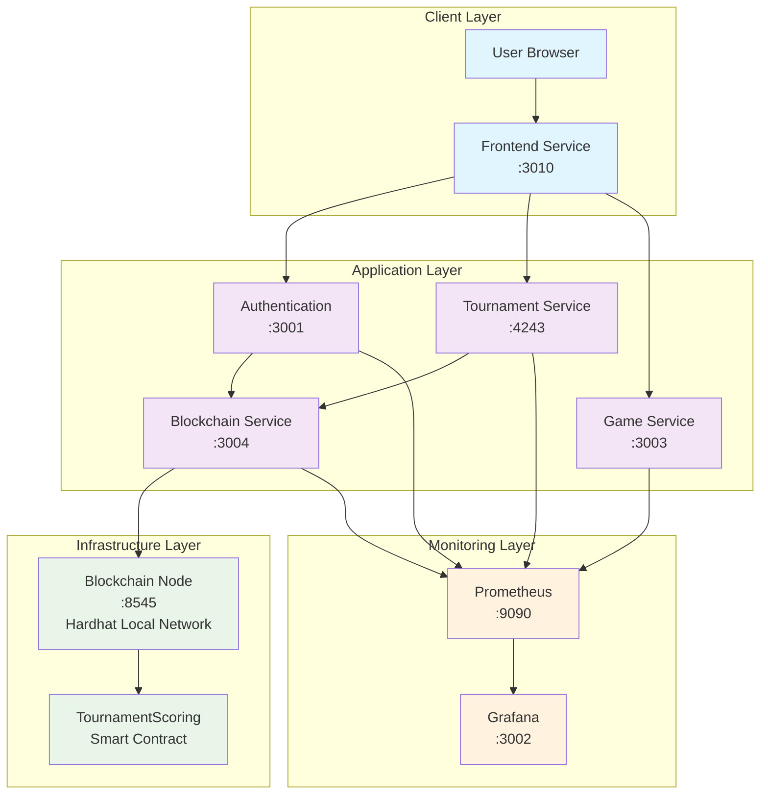

## 🔄 Two-Layer Blockchain Design

### Layer 1: Blockchain Infrastructure (`blockchain-node`)

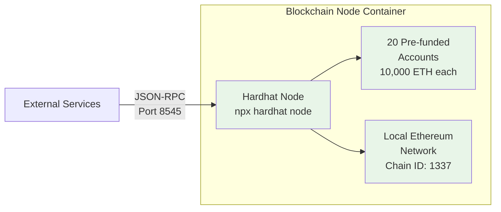

**Responsibilities:**
- ✅ Provides Ethereum-compatible blockchain network
- ✅ Handles transaction mining and block creation
- ✅ Manages account balances and state
- ✅ Exposes JSON-RPC API on port 8545

### Layer 2: Application Service (`blockchain`)

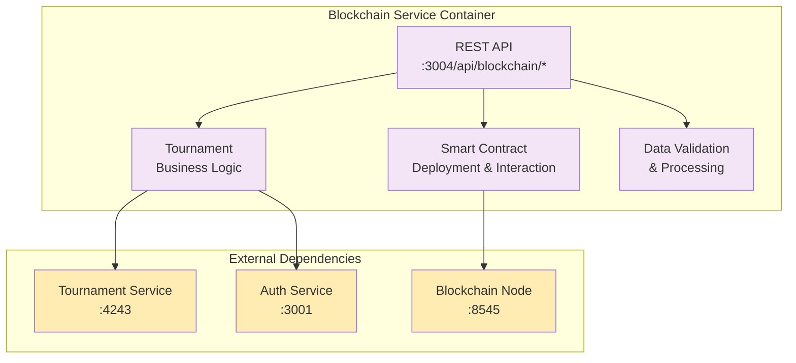

**Responsibilities:**
- ✅ Deploys and manages smart contracts
- ✅ Provides REST API for blockchain operations
- ✅ Integrates with other microservices
- ✅ Handles business logic and validation

## 🔐 Smart Contract Interaction Flow

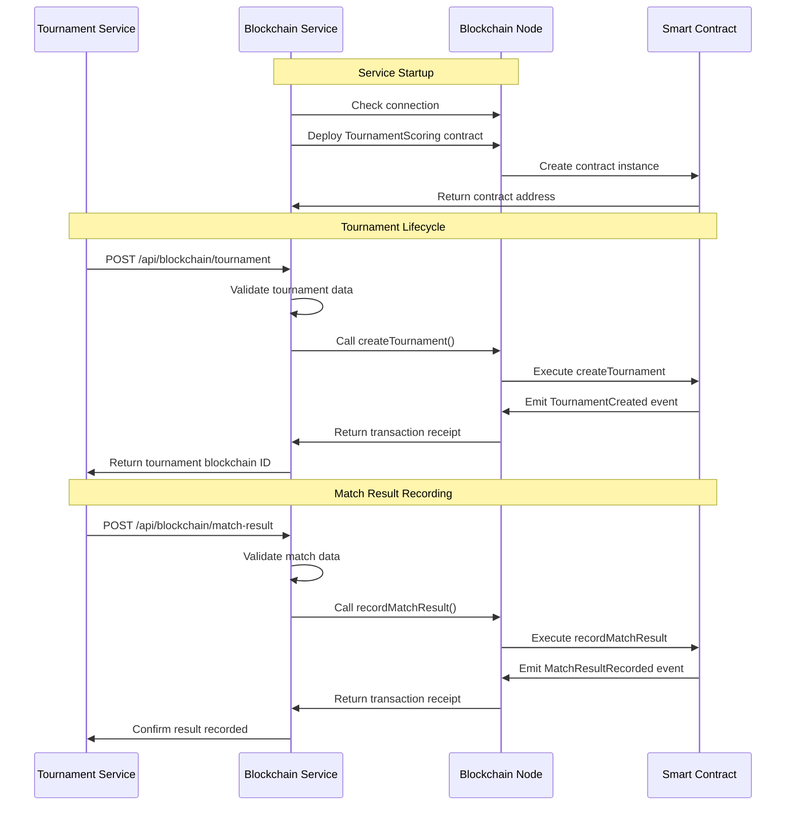

## 📊 Data Flow Architecture

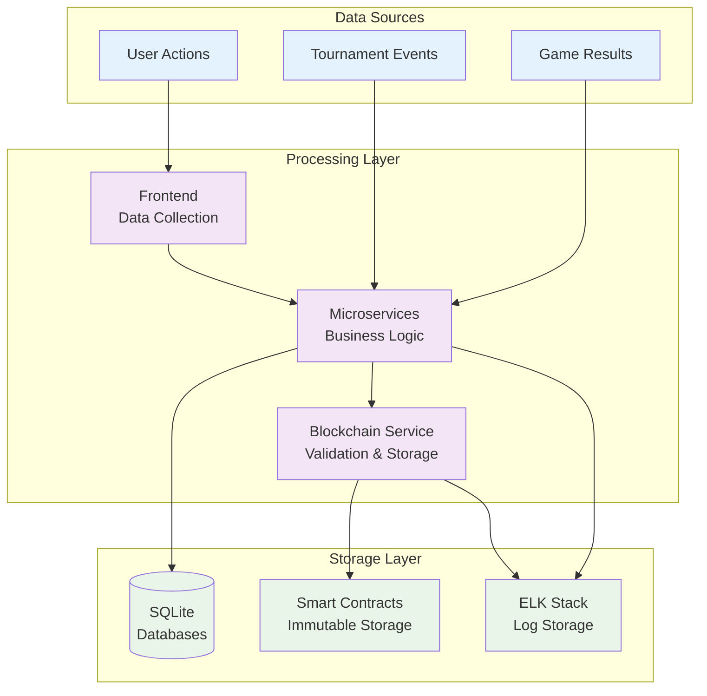

## 🚀 Service Deployment Flow

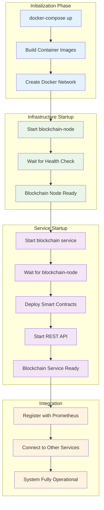

## 🔧 Configuration Architecture

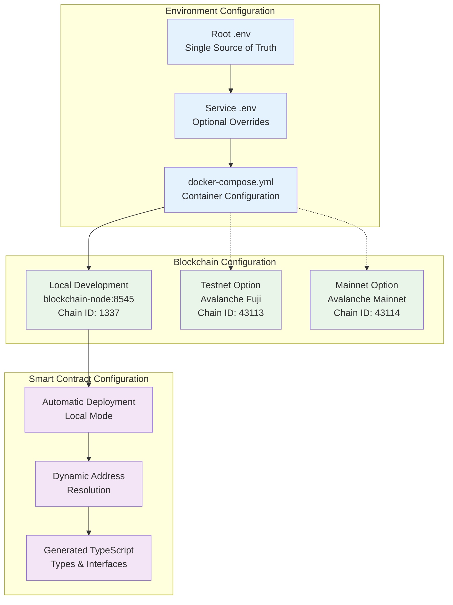

## 📈 Monitoring & Observability

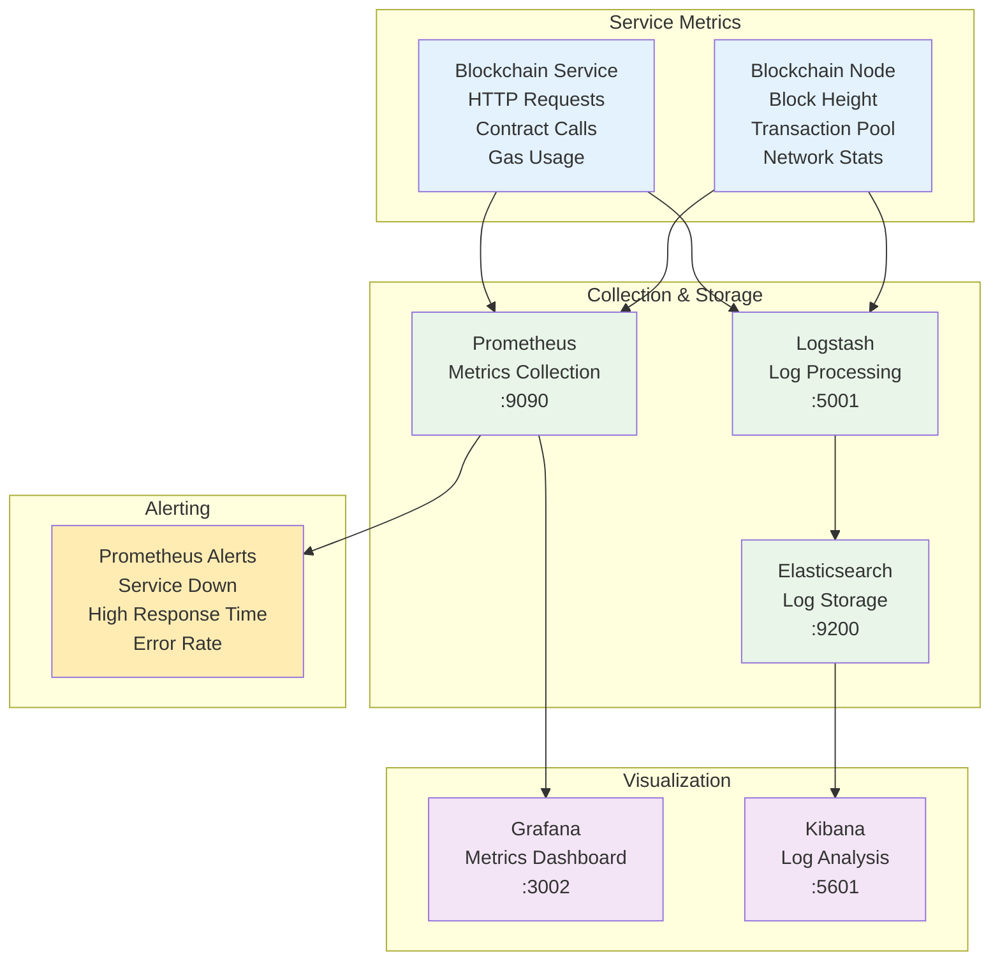

## ⚙️ Docker Services Configuration

### Blockchain Node Service
```yaml
blockchain-node:
  container_name: blockchain-node
  build:
    context: ./packages
    dockerfile: ./blockchain/Dockerfile
    target: development
  command: npx hardhat node --hostname 0.0.0.0 --port 8545
  ports:
    - "8545:8545"
  environment:
    - NODE_ENV=development
  networks:
    - ft-net
  healthcheck:
    test: ["CMD", "sh", "-c", "wget --no-verbose --tries=1 --spider http://localhost:8545 || exit 1"]
    interval: 10s
    timeout: 5s
    retries: 10
    start_period: 30s
```

### Blockchain Application Service
```yaml
blockchain:
  container_name: blockchain
  build:
    context: ./packages
    dockerfile: ./blockchain/Dockerfile
    target: prod
  ports:
    - "3004:3004"
  environment:
    - NODE_ENV=production
    - PORT=3004
    - AVALANCHE_RPC_URL=http://blockchain-node:8545
    - AVALANCHE_CHAIN_ID=1337
    - PRIVATE_KEY=0xac0974bec39a17e36ba4a6b4d238ff944bacb478cbed5efcae784d7bf4f2ff80
  depends_on:
    logstash:
      condition: service_healthy
    blockchain-node:
      condition: service_healthy
```

## 🎯 Benefits of Two-Layer Architecture

### ✅ **Separation of Concerns**
- **Infrastructure layer** handles blockchain protocol
- **Application layer** handles business logic
- Clean boundaries between responsibilities

### ✅ **Scalability**
- Services can scale independently
- Multiple application instances can share one blockchain node
- Easy to switch between different blockchain networks

### ✅ **Development Experience**
- Fast local development with instant transactions
- Deterministic testing environment
- No external dependencies or token requirements

### ✅ **Production Flexibility**
- Easy migration from local to testnet/mainnet
- Configuration-driven blockchain selection
- Maintained separation of concerns in production

### ✅ **Subject Compliance**
- ✅ **"Testing blockchain environment"** - Perfect isolation
- ✅ **"Without risks"** - No external dependencies
- ✅ **"Avalanche + Solidity"** - Compatible tooling and standards

## 🔄 Alternative Deployment Scenarios

### Local Development (Current)
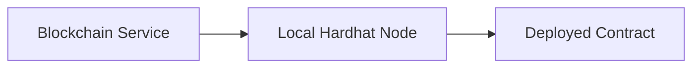

### Testnet Deployment
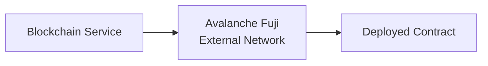

### Production Deployment
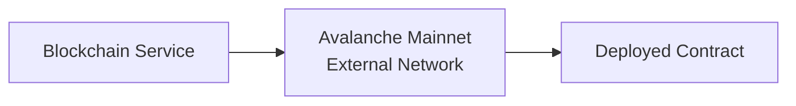

## 📋 Service Dependencies

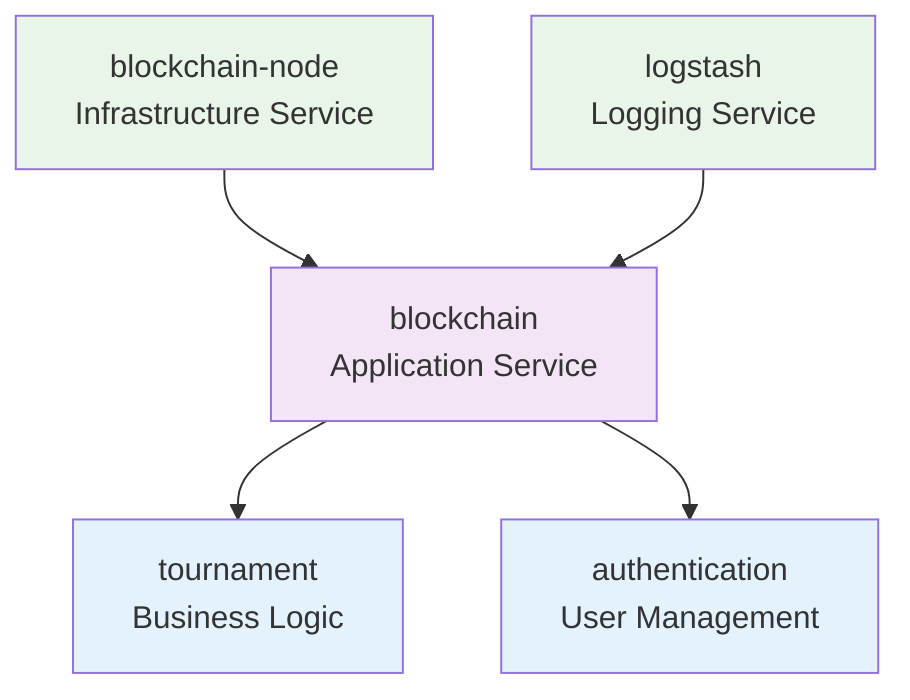

## 🚀 Getting Started

1. **Start the system:**
   ```bash
   docker-compose up -d
   ```

2. **Verify blockchain node:**
   ```bash
   curl http://localhost:8545
   ```

3. **Check blockchain service:**
   ```bash
   curl http://localhost:3004/health
   ```

4. **Monitor with Prometheus:**
   ```bash
   open http://localhost:9090/targets
   ```

This architecture provides a robust, scalable, and maintainable blockchain integration that perfectly aligns with the ft_transcendence project requirements and subject specifications. 